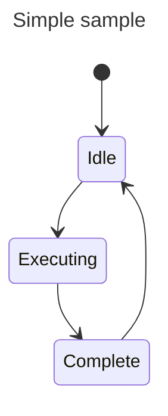
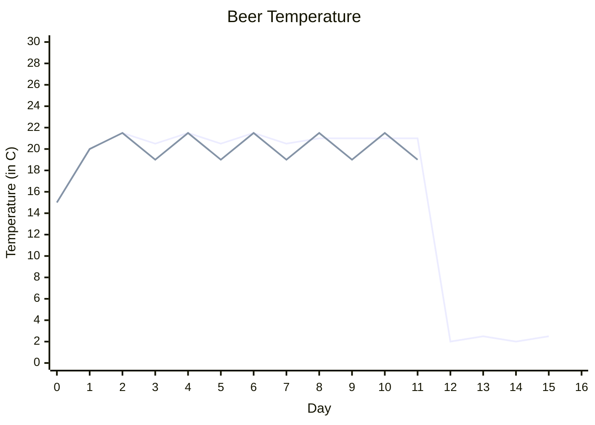

# Job executor

```mermaid
---
title: Simple sample
---
stateDiagram-v2
    [*] --> Idle

    Idle --> Executing
    Executing --> Complete
    Complete --> Idle
```

```mermaid
xychart-beta
    title "Beer Temperature"
    x-axis "Day" [0, 1, 2, 3, 4, 5, 6, 7, 8, 9, 10, 11, 12, 13, 14, 15, 16]
    y-axis "Temperature (in C)" 0 --> 30
    line [15, 20, 21.5, 20.5, 21.5, 20.5, 21.5, 20.5, 21, 21, 21, 21, 2, 2.5, 2, 2.5]
    line [15, 20, 21.5, 19, 21.5, 19, 21.5, 19, 21.5, 19, 21.5, 19]
```